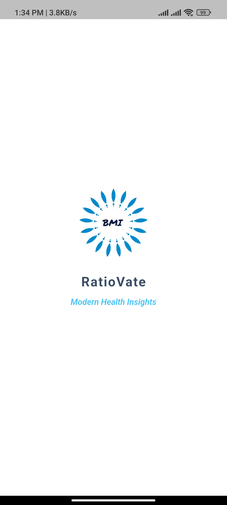
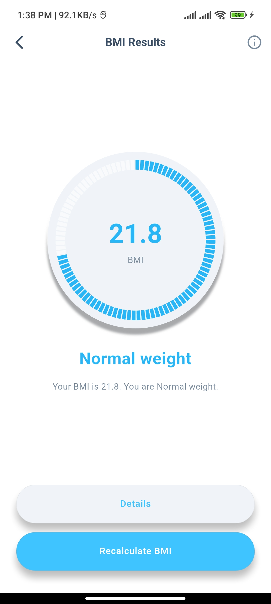
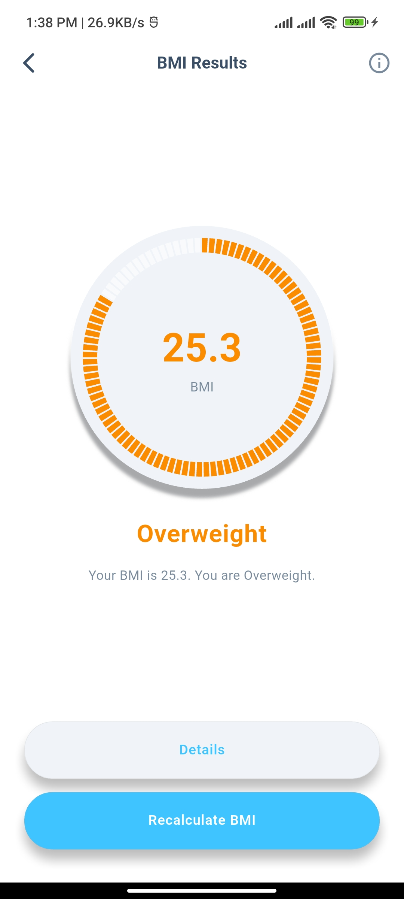
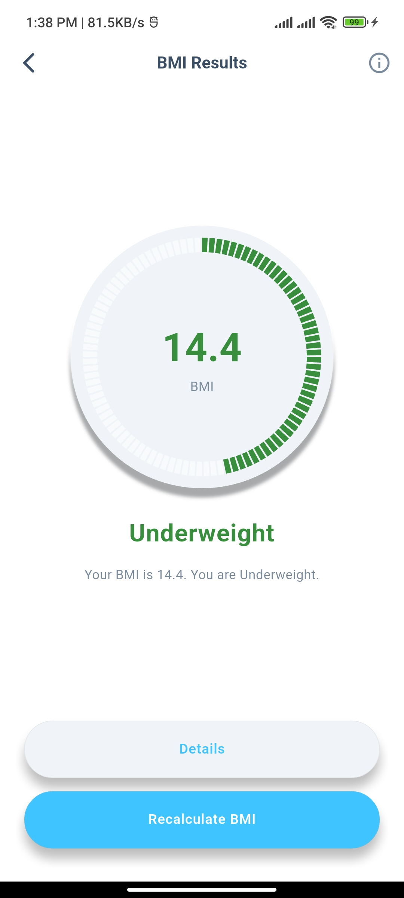
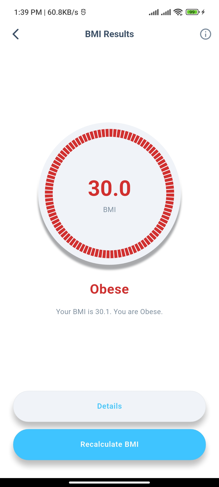
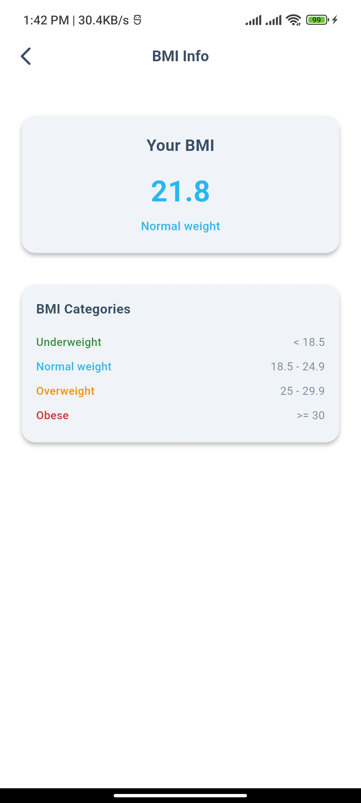

# RatioVate - A Mobile App to Calculate Body Mass Index (BMI).

## Introduction

A sleek, Flutter-based mobile app that helps users quickly calculate their Body Mass Index (BMI) through a clean and intuitive interface.

## App Screenshot

Below are some glimpses of the RatioVate application, showcasing its user interface from the splash screen to the main Functional screens.

<!--suppress CheckImageSize -->







## What's inside

Ratiovate is built with a focus on core BMI calculation functionality and a user-friendly experience.

- **Screens & Features:**
    - **Splash Screen:** A clean and welcoming entry screen, featuring the app icon (splash_icon.png) and transitioning smoothly to the main interface.
    - **BMI Input Screen:** The primary screen where users enter personal information to calculate BMI.
        - **Gender Selection:** Interactive icons for selecting male or female.
        - **Height Input:** A responsive slider for inputting height in centimeters.
        - **Weight & Age Input:** Increment and decrement buttons for adjusting weight (kg) and age (years).
        - **Calculate Button:** A prominent button that triggers the BMI calculation.
    - **BMI Result Screen:** Displays the calculated BMI value, category (e.g., Underweight, Normal, Overweight), and a brief health interpretation.
    - **BMI Details Screen:** (Optional)May provide extended insights or recommendations based on the user's BMI.

- **Key UI/UX Elements:**
    - **Clean Design:** A visually minimal and easy-to-navigate interface focused on quick access and clarity.
    - **Google Fonts:** Uses clean and modern typography via Google Fonts for readability.
    - **Custom Icons:** Includes custom icons for gender selection and app branding.
    - **Responsive Layout:** Optimized to look great across different mobile devices.
    - **Consistent Color Scheme:** Defined in app_colors.dart for a cohesive visual experience.

- **Backend & Services:**
    - **Local Application:** Ratiovate operates entirely offline, performing all calculations locally on the device.

## Installation

To get RatioVate up and running on your local development environment, follow these steps:

**Step 1:**

Clone this repository to your local machine (or download the source code).

```
git clone https://github.com/ashy-sandhu/ratiovate.git
```

**Step 2:**

Ensure you have Flutter installed on your system. You can find the installation guide on the official Flutter website: [Flutter installation guide](https://docs.flutter.dev/get-started/install).

**Step 3:**

Navigate to the project's root directory in your terminal:

```sh
cd path/to/ratiovate
```

**Step 4:**

Fetch the project dependencies by running the following command:

```sh
flutter pub get
```

**Step 5:**

Once the dependencies are installed, you can run the application on a connected device or emulator:

```sh
flutter run
```

## About the Author

Qurio is Developed by [Ahsan Malik/Code Harbor].

*   GitHub: [https://github.com/ashy-sandhu]
*   LinkedIn: [www.linkedin.com/in/ahsan-malik-2990722b9]

## Thanks To

This project utilizes several open-source packages and resources. Special thanks to:

*   The Flutter framework by Google.
*   `google_fonts` for beautiful typography.
*   Other dependencies listed in `pubspec.yaml`.

## License

RatioVate is under MIT License.
